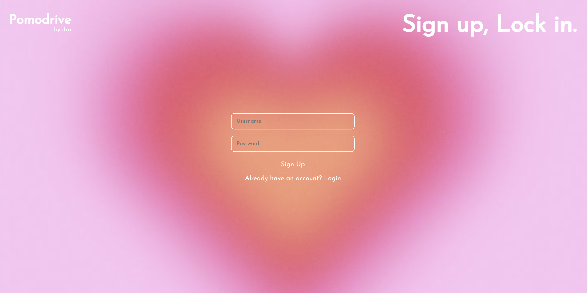
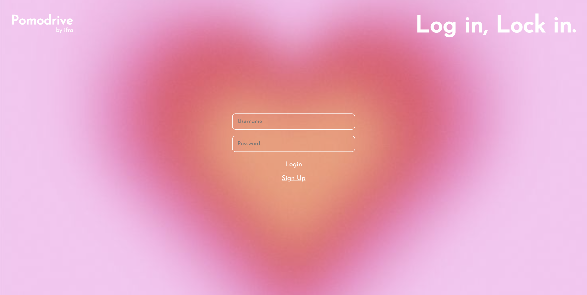
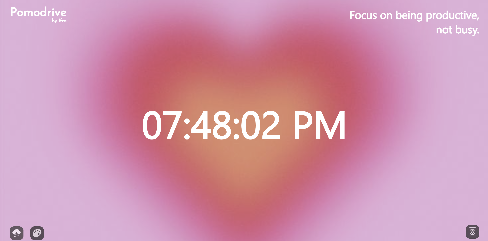
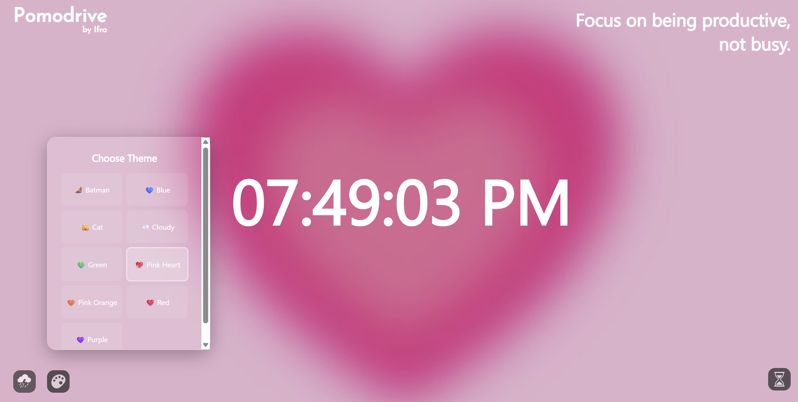
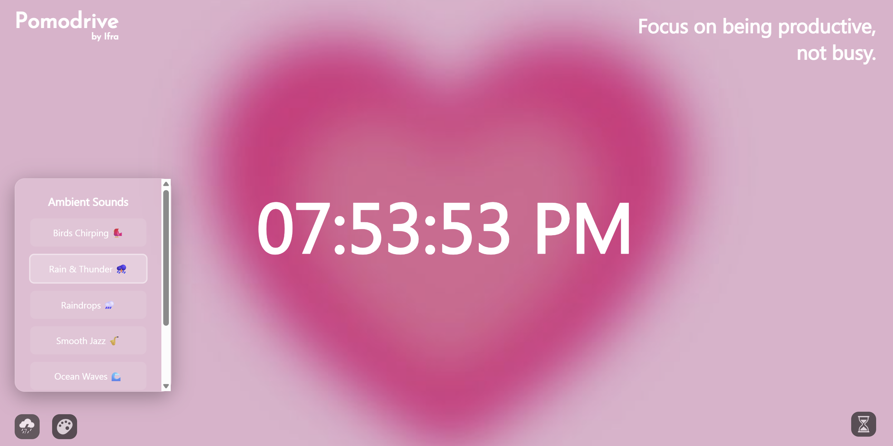
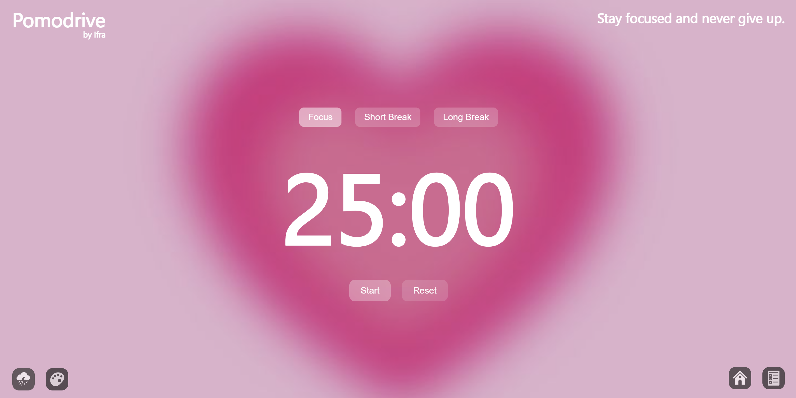
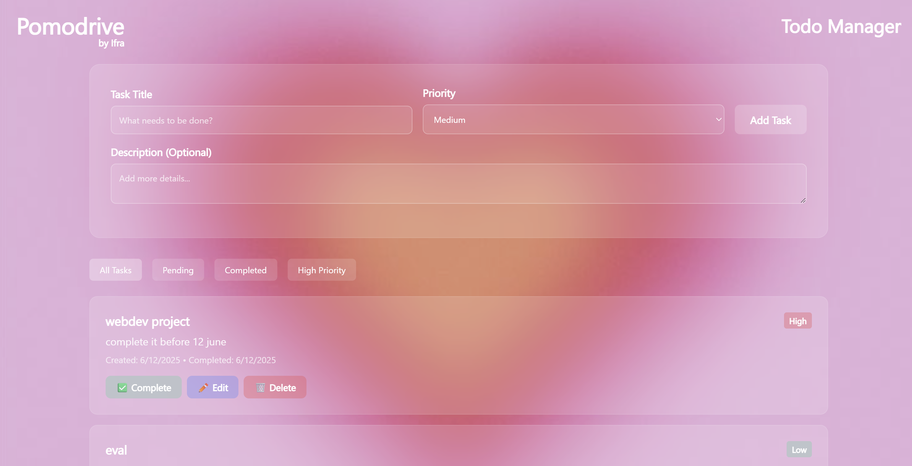

# Pomodrive

**Pomodrive** is a personalized productivity web app inspired by Flocus. It combines a **Pomodoro timer**, a **focus dashboard**, a **themed UI**, ambient **background sounds**, and a **to-do list** with persistent task tracking. Built using **JSP/Servlets ** and **SQLite**, it offers a simple and visually engaging interface to help users focus, track progress, and manage tasks effectively.

---

## preview
- signup page

- login page

- home page

- change themes 
it will be changed accross all pages

- add bg sound

- pomodro sessions on focus page

- todo list

## Features

###  Pomodoro Timer
- Focus, short break, and long break cycles
- Tracks completed Pomodoro sessions per user
- Visual timer with controls (reset etc)

### Focus Dashboard
- Personalized homepage showing:
  - Time and greeting
  - Quote 
  - Theme and sound toggle options
- Allows the user to customize themes and ambient sounds

### To-Do List
- Persistent task management tied to logged-in user
- Add, complete, delete, edit and prioritize tasks
- Tasks stored in SQLite, fetched via REST-style endpoints (`/api/todos`)
- Tracks metadata like creation/completion time, priority, and status

### Theming & Background Sounds
- Multiple UI themes: Default, Dark, Ocean, Sunset
- Sound options: Ambient, Rain, Forest, or None
- Preferences saved per user session (via `localStorage`)

---

## Tech Stack

- **Frontend**: HTML, CSS, JavaScript, Material Icons
- **Backend**: Java Servlet + JSP (Java EE)
- **Database**: SQLite (embedded)
- **Server**: Apache Tomcat 10.x
 
---

## Getting Started

### 1. Prerequisites
- Java 17+ installed
- Apache Tomcat 10.1.x
- SQLite JDBC driver (already included in `lib/`)
- (Optional) An IDE like vs code

### 2. Setup Instructions

#### Step 1: Build Project
Ensure your `src` folder is compiled and output to the `WEB-INF/classes/` directory.

#### Step 2: Set Up SQLite Database
Database will be auto-initialized on first run.
Make sure the `focusboard.db` file exists in the correct path (`webapps/Pomodrive/focusboard.db`), or it will be created automatically.

#### Step 3: Deploy to Tomcat
- Copy the entire `Pomodrive/` folder into `apache-tomcat/webapps/`
- Start Tomcat using `bin/startup.bat` (Windows) or `bin/startup.sh` (Linux/Mac)
- Visit: `http://localhost:8080/Pomodrive/login.jsp`

---

## Usage

1. **Register** an account via `register.jsp`
2. **Login** with your credentials
3. Use the homepage (`home.jsp`) to:
   - View greeting, quotes, and time
   - Customize your theme and background sound
4. Navigate to **Focus Mode** (`focus.jsp`) to:
   - Run Pomodoro sessions
   - Track stats
5. Manage tasks in the **To-Do List** (accessible from focus or home pages)

--- 

## Notes

- All data is stored locally in `SQLite` (`.db` file), scoped to the current user.
- No external server or cloud setup required.
- The backend uses simple `HttpServlet`s and `@WebServlet("/api/...")` routing.

---
